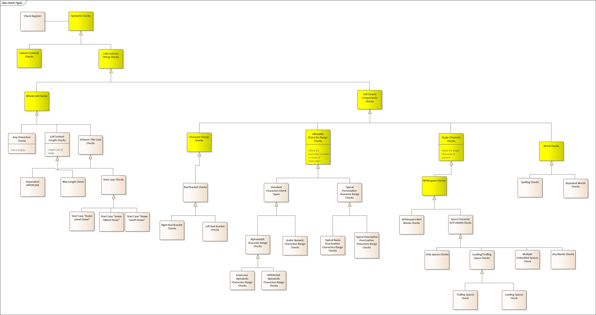

# Syntactic Checker

##Introduction

These services are a component of the go_bCLEARer toolkit. They provide
syntactic analysis of a set of strings in a dataset (e.g. a column). The
syntactic analysis is one of the first steps in the bCLEARer evolve
stage for string-based columns.

## Conceptual Design

### Syntactic Check Types

The syntactic checker performs a series of checks based on the
configuration file. These checks can be performed across the entire
column or within a cell. When performed for the whole column, they
provide an overview of the characters used across all columns. When
performed within a cell they can cover the entire cell or just a part of
it. The full check type classification is as follows (this is a partial
taxonomy illustrating the broad structure):

### String Check Patterns

These can be defined as fixed strings, regexs or ANTLR grammar rules.

### Fixes

The syntactic checker can also implement fixes to the checked data.

For doing this, it uses the [string editor services](https://github.com/OntoLedgy/string_editing_services).

### Reports

TBD

## Process Design

TBD

